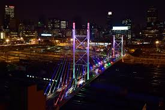

<!DOCTYPE html>
<html>
  <head>
    <meta charset="utf-8">
    <meta name="viewport" content="width-device, initial-scale=1.0">
    <title>Flight Page</title>
    <link rel="stylesheet" href="style.css">
  </head>
  <body>
     <!--Navbar-->
     <nav id="navbar">
    <section>
      <header>
        <h2><a href="home">Book Your Flight With Us</a></h2>
          <ul>
            <li><a href="#home">Home</a></li>
            <li><a href="#flights">Flights</a></li>
            <li><a href="#destinations">Destinations</a></li>
            <li><a href="#aboutus">About Us</a></li>
           <li><a href="#contacts">Contacts</a></li>
          </ul>
      <!--Showcase Area-->
      

        

          <h1>Book Your Flight With Us</h1>
          
Weather you are jetting off to for pleasure or travelling off to 
            business, we offer flight deals in best destinations in 
            the world. Find your domestic airfare and get ready to explore 
            the sight from sea to shining sea.
          
     
          <a href="#flights" class="btn">Book Now</a>
          </a>
          </h2>
        

        

     
    </nav>  
  <!--Flights-->
  <header>
  <header id="flights">
      

        

          <h3>Flight Booking</h3>
          <form id="flightForm">
              <label for="fullName">Full Name:</label>
              <input type="text" id="fullName" name="fullName" required> 
  
              <label for="email">Email:</label>
              <input type="email" id="email" name="email" required> 
  
              <label for="departure">Departure City:</label>
              <input type="text" id="departure" name="departure" required>> 
  
              <label for="destination">Destination City:</label>
              <input type="text" id="destination" name="destination" required> 
  
              <label for="date">Departure Date:</label>
              <input type="date" id="date" name="date" required> 
  
              <label for="passengers">Number of Passengers:</label>
              <input type="number" id="passengers" name="passengers" min="1" required> 
  
              <button type="button" onclick="submitForm()">Book Now</button>
          </form>
      

      

      </header>
      </header>

      <header>
  <header id="CheckFlightDetails">
      

        

          <h3>Check your flight Details</h3>
          <form id="flightForm">
              <label for="searchTerm">Enter full name or email:</label>
              <input type="text" id="searchTerm" name="searchTerm" required> 
  
              <button type="button" onclick="checkFlightDetails()">Check Flight Details</button>
          </form>

          

      

      

      </header>
      </header>
    </header>
  </section>
  <!--Destinations-->
  <header>
    <header id="destinations">
  

    <h4>Explore Destinations</h4>
    

        

            
            <h5>Maldives, Asia</h5>
            
The Maldives seems to have had an image change, thanks to the pandemic. Once the go-to destination for diving and surfing enthusiasts, the untainted paradise has resurfaced as the glamorous Tulum of the East, becoming a magnet to jet setting Indians (and every influencer worth his/her following) who are on the lookout for ’grammable locations.
              While wandering its white beaches and soaking up its cerulean sea are still recommended activities, here we shortlist five exclusive experiences that will have you googling the next flight to the archipelagic nation.

            <a href="booking.php?destination=1">Book Now</a>
        

        

            
            <h5>New York, USA</h5>
            

              New York is one of America’s most exciting states. With charming upstate scenery, world-class cuisine and culture and more things to do than you could fit in one lifetime. The city’s five boroughs all have special features; it’s almost impossible to narrow it down”
            

            <a href="booking.php?destination=2">Book Now</a>
        

        

            
            <h5>London, England</h5>
            

              Among the few places where you can have a wide variety of people, cultures, and buildings for photography, London comes first. The city has some eye-catching and exquisite views that deserve to be photographed. No matter whether you aspire to capture snazzy streets, splendid terraces, or other natural and artificial beauty, London offers aesthetic views in every nook and corner.
            

            <a href="booking.php?destination=3">Book Now</a>
        

        

          
          <h5>Dubai, UAE</h5>
          

            UAE is a country boasting architectural brilliance and there are very few countries that possess magnificent skyscrapers like the UAE. Among all the cities of the UAE, Dubai is the most beautiful city having luminous and sublime buildings and skyscrapers. Burj Khalifa, the tallest building in the world is located in Dubai containing a hotel, residences, and offices. Likewise, another tall and eye-catching building is Burj Al Arab which is a luxury hotel standing on an artificial island from Jumeirah beach 

          <a href="booking.php?destination=3">Book Now</a>
      

      

        
        <h5>Cape Town, South Africa</h5>
        

          From flat-topped Table Mountain down to the blue waters of Table Bay, Cape Town is simply stunning, but the city doesn't thrive by its looks alone. Proudly multicultural, its flourishing arts, dining, and nightlife scenes are proof of this modern metropolis' creativity and innovative spirit.
        

        <a href="booking.php?destination=3">Book Now</a>
    

    

      
      <h5>Beijing, China</h5>
      

         Beijing, city, province-level shi (municipality), and capital of the People’s Republic of China. Few cities in the world have served for so long as the political headquarters and cultural centre of an area as immense as China. The city has been an integral part of China’s history over the past eight centuries, and nearly every major building of any age in Beijing has at least some national historical significance. The importance of Beijing thus makes it impossible to understand China without a knowledge of this city.
      

      <a href="booking.php?destination=3">Book Now</a>
  

    

</header>
</header>

<!--Aboutus-->
<header>
  <header id="aboutus">

  <h6>About Us</h6>
   
  
Welcome to our flight booking platform! We are passionate about providing travelers with seamless and memorable travel experiences. With our user-friendly interface and extensive network of airlines, we strive to make flight booking convenient and hassle-free for our customers.

  
At our core, we believe in delivering exceptional customer service and ensuring customer satisfaction. Whether you're planning a business trip or a vacation, our dedicated team is here to assist you every step of the way.

  
As avid travelers ourselves, we understand the excitement and anticipation that comes with exploring new destinations. That's why we are committed to offering competitive prices, reliable booking services, and valuable travel insights to help you make the most of your journey.

  
Thank you for choosing us as your trusted travel partner. We look forward to helping you plan your next adventure!

</header>
</header>

<!--ContactUs-->
<header>
  <header id="contactus">
    

        <h6>Contact Us</h6>
        <form action="contact.php" method="POST">
            <label for="name">Name:</label>
            <input type="text" id="name" name="name" required>

            <label for="email">Email:</label>
            <input type="email" id="email" name="email" required>

            <label for="message">Message:</label>
            <textarea id="message" name="message" required></textarea>

            <input type="submit" value="Send Message">
        </form>
    
  
    </header>
    </header>

    

  </body>
  </html>
